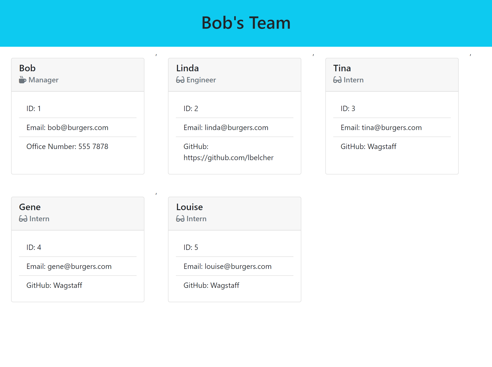

# Team Generator

## Table of Contents

- [Team Generator](#team-generator)
  - [Table of Contents](#table-of-contents)
  - [Demo Video](#demo-video)
  - [Getting Started](#getting-started)
    - [Get the project](#get-the-project)
    - [How to run the project](#how-to-run-the-project)
    - [How to test the project](#how-to-test-the-project)
    - [Description](#description)
    - [What Was Done](#what-was-done)
    - [Screenshots](#screenshots)
      - [Sample generated HTML](#sample-generated-html)

## Demo Video

[Click here](https://soumeyah.github.io/daily_work_scheduler/) to see a short demonstration and explanation of the app.

## Getting Started

### Get the project

```
Clone the GitHub project onto your local machine
Navigate into the project folder
Open the project in VSCode
Install npm
```

### How to run the project

```
npm install / npm i
```

### How to test the project

```
npm run test
npm run test:watch
```

### Description

An app that creates a HTML document for a given team. Where each team contains a single manager along with as many engineers and interns required, and the individual members of a team are rendered as separate cards.

### What Was Done

- Used Inquirer to prompt users for inputs.
- Used user inputs to generate the readme file.
- Used module.exports to separate functions into separate files.
- Used classes to create employee object
  - extended employee object to create engineer, manager and intern classes.
- Used Jest for unit testing.

### Screenshots

#### Sample generated HTML


